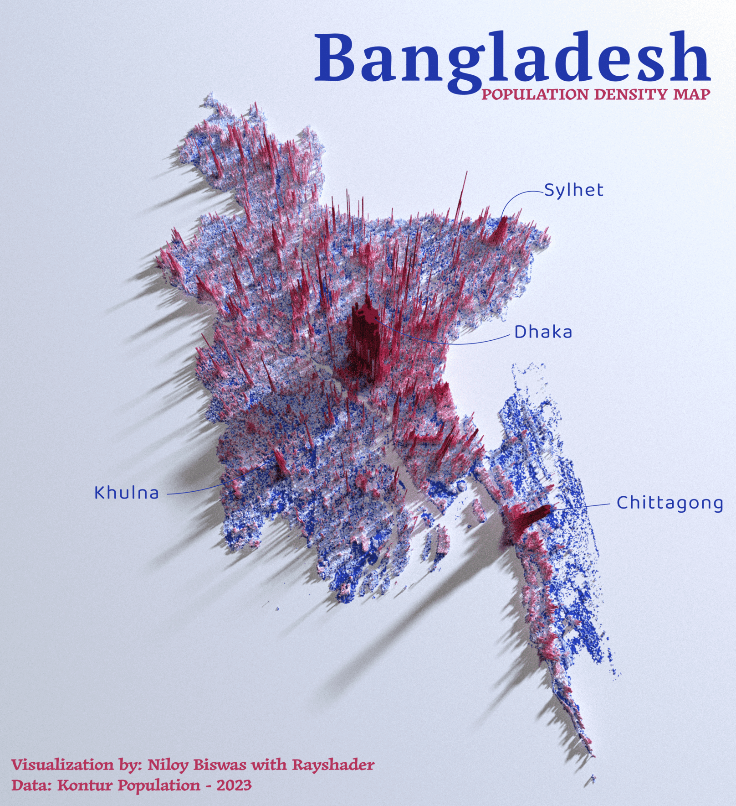
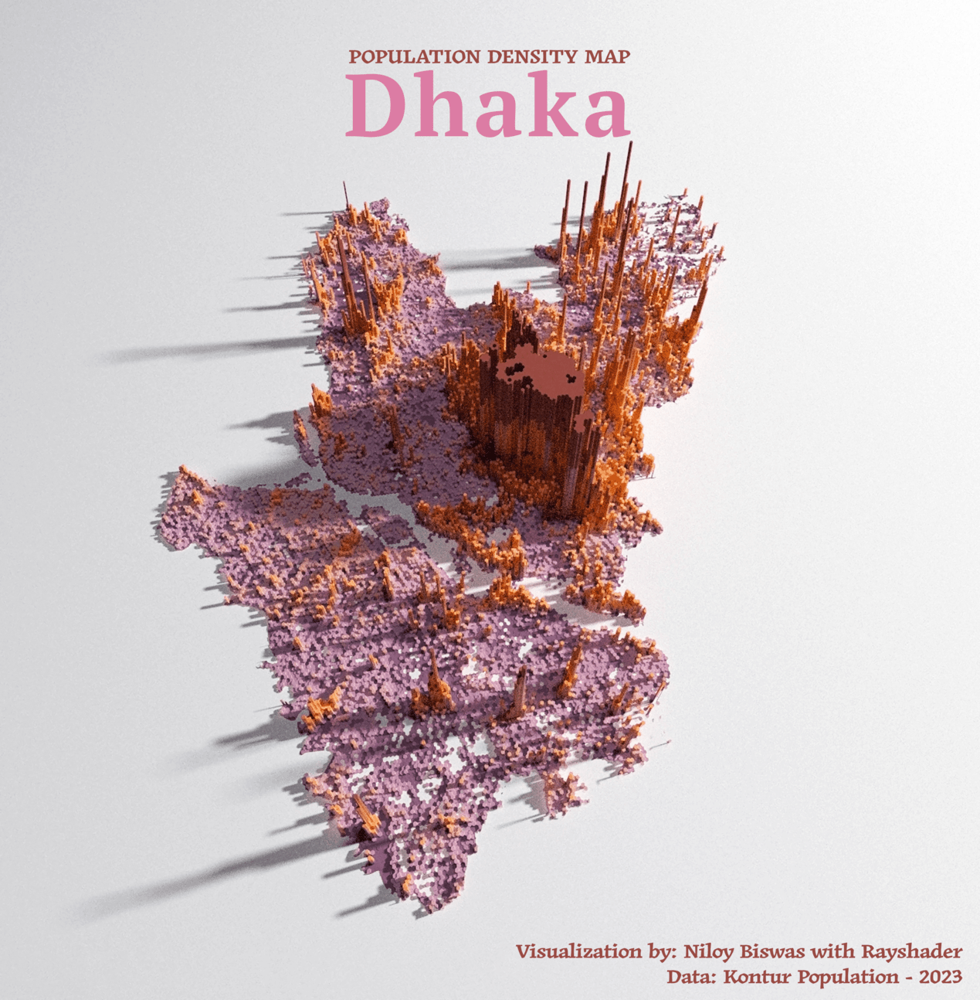

# Population Density Map

This repository contains scripts and data for creating population density maps, with a focus on Bangladesh. It utilizes R programming for data analysis and visualization.

## Files
- `Data`: Directory containing population data.
- `Scripts`: R scripts for processing and visualizing data.

## Usage
1. Clone the repository.
2. Navigate to the R `Scripts` 
3. Run the R scripts to generate population density maps.

## Requirements
- R programming environment.
- Relevant R libraries as per the scripts.

## Bangladesh

## Dhaka

## Chittagong

## Barishal

## India

## Nepal

## Bhutan

## Sri Lanka

## Mayanmar

## Maldives

## Contributing
Contributions to improve the scripts or extend the data coverage are welcome. Please fork the repository, make your changes, and submit a pull request.